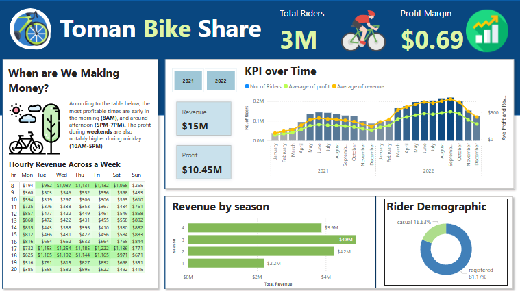

# Toman Bike Share Analysis Dashboard

## 📧 Project Brief

This project is based on a **fictional email request** from a company stakeholder asking for the development of a dashboard to support key performance metrics and decision-making.

**Email Request Summary:**

> **Subject:** Request for Development of Toman Bike Share Dashboard
> **Dear Data Analyst,**
> We need your expertise to develop a dashboard for "Toman Bike Share" that displays our key performance metrics for informed decision-making.
>
> **Requirements:**
>
> * Hourly Revenue Analysis
> * Profit and Revenue Trends
> * Seasonal Revenue
> * Rider Demographics
>
> **Design and Aesthetics:** Use our company colors and ensure the dashboard is easy to navigate.
>
> **Data Source:** Access to our databases will be provided. If no database, please create one.
>
> **Deadline:** We need a preliminary version ASAP.
>
> **Please provide an estimated timeline for completion and recommendation on raising prices next year.**
>
> Best regards,

---

## 📊 Project Overview

This project analyzes usage and profitability metrics for a fictional bike share company called **Toman Bike Share**. The dataset spans two years (2021 and 2022), and the goal was to extract insights and build an interactive Power BI dashboard to support data-driven decisions on pricing, marketing, and operations.

---

## 📁 Dataset

**Files Used:**

* `bike_share_yr_0.csv`
* `bike_share_yr_1.csv`
* `cost_table.csv`

**bike\_share\_yr\_0/1.csv Columns:**

* `dteday`, `season`, `yr`, `mnth`, `hr`, `holiday`, `weekday`, `weathersit`, `temp`, `atemp`, `hum`, `windspeed`, `rider_type`, `riders`

**cost\_table.csv Columns:**

* `year`, `price`, `COGS` (Cost of Goods Sold)

---

## 🛠️ Data Preparation (SQL)

1. Union `bike_share_yr_0` and `bike_share_yr_1`.
2. Join with `cost_table` to attach `price` and `COGS` values.
3. Add calculated columns:

   * `revenue = riders * price`
   * `profit = revenue - COGS`
4. Export final table with the following columns:

   * `dteday`, `season`, `yr`, `mnth`, `hr`, `holiday`, `weekday`, `rider_type`, `riders`, `price`, `COGS`, `revenue`, `profit`

---

## 📈 Dashboard Features (Power BI)

* **Hourly Revenue Across the Week**: Table showing profitability by hour & weekday.
* **KPI Over Time**: Clustered column + line chart displaying riders, revenue, and profit monthly.
* **Revenue by Season**: Horizontal bar chart.
* **Rider Demographic**: Donut chart showing breakdown of casual vs. registered riders.
* **Summary Cards**: Total Riders, Profit Margin, Total Revenue, and Total Profit.

### 🔄 Interactivity

* **Year Slicer**: Toggle between 2021 and 2022.
* **Chart Highlighting**:

  * Click a **season** → filters all visuals.
  * Click a **rider type** → shows their specific contribution.
  * Click a **month** → drills into monthly metrics.

---

## 🔍 Insights

* **Price increased** \~25% (from \$3.99 to \$4.99).
* **Rider demand increased** \~65% over two years.
* **Profit margin**: 0.69.
* **Peak hours**:

  * Weekdays: 8AM, 5PM–7PM.
  * Weekends: 11AM–5PM.
* **Seasonality**: Highest revenue from June–September (Season 3).
* **User breakdown**: 81.17% registered, 18.83% casual.
* **Post-Sept 2022 decline**: Possible seasonal or behavioral dip.

---

## 💡 Recommendations

* **Cautious price increases**: Monitor demand elasticity.
* **Reactive pricing strategy**: Use customer feedback and sales data.
* **Tiered pricing model**: Different rates for registered vs. casual riders.
* **Seasonal promotions**: Maximize revenue during peak (summer) months.

---

## 🗃️ How to Use / Run

1. Open the Power BI file `toman_bike_share.pbix`.
2. Refresh data if needed.
3. Use the slicers and visuals to explore metrics.

---

## 📚 Credits

Dashboard inspired by [Absent Data's YouTube tutorial](https://www.youtube.com/@AbsentData), with custom enhancements and analysis.

---

## 📌 License

MIT License. This project is for educational and portfolio use.

---

